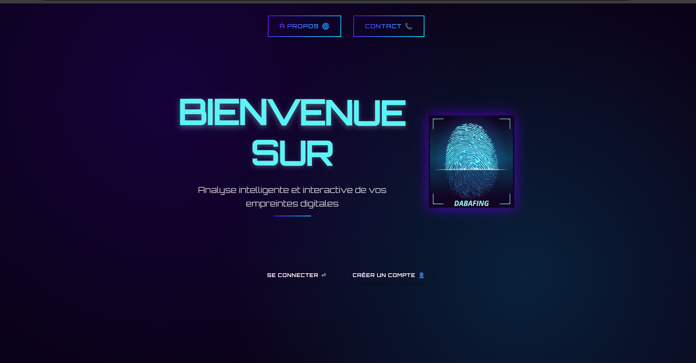
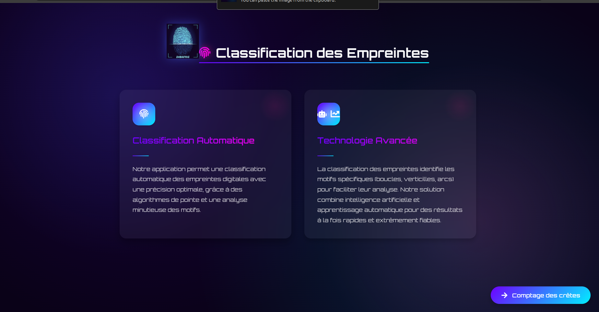
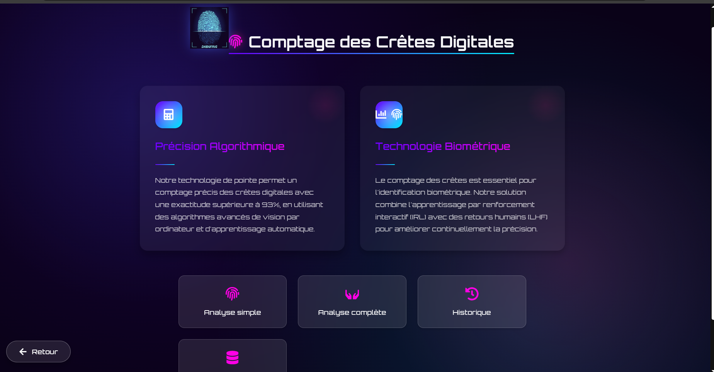
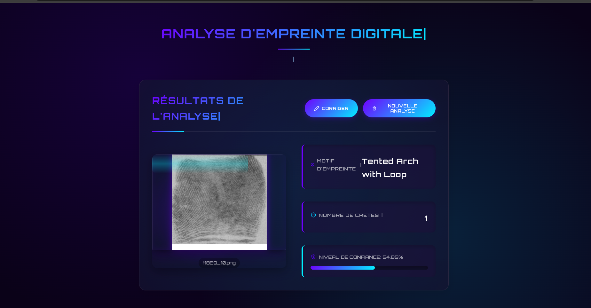
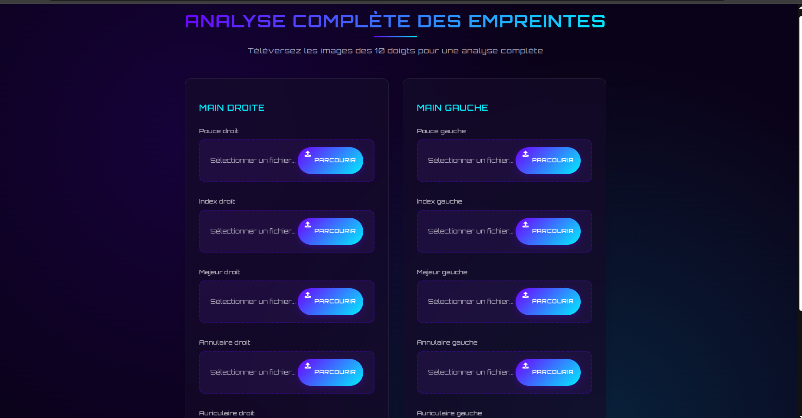

# DabaFing: Web Application for Fingerprint Classification and Ridge Counting

## Overview

**DabaFing** is a robust web application for fingerprint pattern classification and ridge counting, designed for biometric analysis and research. Built with a modern Python/Flask backend and a React frontend, it leverages deep learning (PyTorch, Keras) and a PostgreSQL database.  
A key innovation is the integration of Interactive Reinforcement Learning (IRL), enabling the model to improve continuously through human feedback and incremental retraining.

---

## Application Preview

Below are screenshots showing key features and workflow of the DabaFing web application:

<p align="center">
  
  
  
  
  

</p>

---

## Features

- **Fingerprint Classification**: Predicts fingerprint pattern class using state-of-the-art CNNs (MobileNet, EfficientNet, ResNet, RepVGG).
- **Ridge Counting**: Automatically estimates ridge count for each fingerprint.
- **Human-in-the-Loop Learning (IRL)**: Users can submit corrections; validated feedback is used for incremental model retraining.
- **Admin Dashboard**: Manage users, monitor model metrics, review and validate corrections, and trigger retraining.
- **Secure Authentication**: User registration, login, password reset, and role-based access (admin/user).
- **Automatic Data Validation**: Ensures class balance and data sufficiency before retraining.
- **API Endpoints**: RESTful API for all core functionalities.
- **Cross-platform Ready**: Designed for easy adaptation to desktop and mobile.

---

## Technologies Used

- **Backend**: Python, Flask, Flask-Login, Flask-Mail, Flask-Limiter, Flask-CORS, Flask-Talisman, SQLAlchemy, APScheduler
- **Machine Learning**: PyTorch, Keras, TensorFlow, scikit-learn, torchvision
- **Frontend**: React, JavaScript, HTML/CSS
- **Database**: PostgreSQL
- **Other**: Docker-ready structure, APScheduler for automated retraining checks

---

## Setup & Installation

### Prerequisites

- Python 3.8+
- Node.js & npm
- PostgreSQL
- (Optional) CUDA for GPU acceleration

### Backend Setup

```bash
cd backend
python -m venv venv
source venv/bin/activate
pip install -r requirements.txt
# Configure your database in app.py or via environment variables
# Initialize the database
flask db upgrade  # or use your preferred migration/init method
```

### Frontend Setup

```bash
cd frontend
npm install
npm run build
```

### Database

- Edit `backend/schema.sql` as needed and apply to your PostgreSQL instance.

---

## Usage

- **Start backend**:  
  ```bash
  cd backend
  flask run
  ```
- **Start frontend (dev mode)**:  
  ```bash
  cd frontend
  npm start
  ```
- **Access the app**:  
  Open [http://localhost:5173](http://localhost:5173) in your browser.

---

## Key Endpoints

- `/register`, `/login`, `/logout`, `/profile`
- `/fingerprint` (POST): Predict class & ridge count
- `/fingerprint/correction` (POST): Submit correction
- `/admin/incremental-training/check` (GET): Check retraining conditions
- `/admin/incremental-training/start` (POST): Trigger incremental retraining
- `/admin/incremental-training/history` (GET): Training history

---

## Human-in-the-Loop (IRL) Workflow

1. **User submits a fingerprint** → model predicts class & ridge count.
2. **User/admin reviews & corrects** if needed.
3. **Admin validates corrections**.
4. **System checks data sufficiency** and triggers incremental retraining automatically or manually.
5. **Model is updated** and deployed without downtime.

---

## Security & Best Practices

- All sensitive data (passwords, API keys) should be stored in environment variables, not in code.
- Use HTTPS in production (Flask-Talisman is preconfigured).
- Rate limiting and CORS are enabled.
- Regularly backup your database and models.

---

## License & Data Access

This project is a research work conducted at **ISICOD - Ingénierie des systèmes d'information** as part of an academic internship.  
Our exclusive fingerprint database offers high-resolution images for academic research. The dataset, trained models, and related resources are private.  
To request access to the full dataset and resources, please contact the internship supervisor:

**Demande d'accès:**  
jean.bosco@e-polytechnique.ma

---

## Authors

This project was developed by a multidisciplinary team:
- **AI & Model Development** 
- **Web Application & Integration** 

---

## Acknowledgements

- Open-source libraries: PyTorch, Flask, React, etc.
- All datasets and models are proprietary and available upon request (see above).
